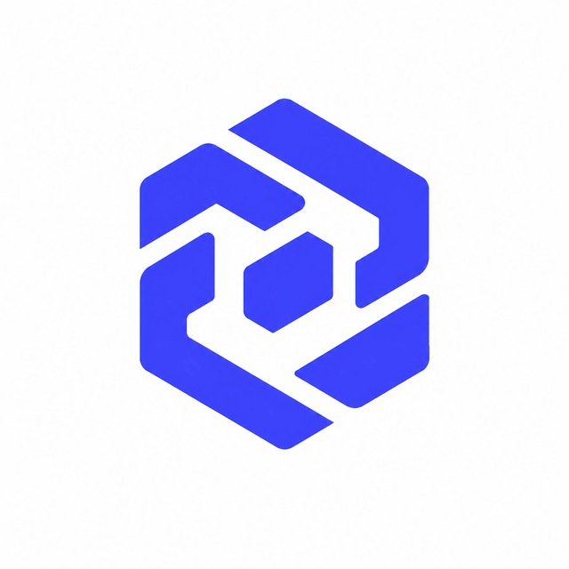

# CODE NATION

### Building Future Through Technology

### 🚀 Outsourcing • 💡 Startup Development • 🎓 IT Academy

---

# 👋 Welcome to Code Nation

We build modern software products that help businesses grow.

From startup ideas to enterprise systems, our team delivers scalable, secure and high-performance solutions.

---

# 🚀 Our Services

- 💻 Custom Software Development
- 🌐 Web Applications
- 📱 Mobile Applications
- 🚀 Startup MVP Development
- 🤖 AI Solutions
- ☁ Cloud Solutions
- 🏢 CRM / ERP Systems
- 🎓 IT Education & Mentorship

---

# ⚙ Tech Stack

### Frontend

- React
- Next.js
- TypeScript
- TailwindCSS

### Backend

- Node.js
- Express.js
- NestJS

### Database

- MongoDB
- PostgreSQL
- MySQL
- Redis

### DevOps

- Docker
- Linux
- Git
- GitHub Actions

---

# 📂 Featured Projects

⭐ CodeNation Academy

⭐ Jarvis AI Assistant

⭐ ChatLink

⭐ EduNation

⭐ CRM Platform

⭐ ERP Platform

---

# 📈 GitHub Stats

---

# 🔥 Current Focus

- 🚀 Building Startups
- 💻 Outsourcing Projects
- 🤖 Artificial Intelligence
- 🌍 Scalable Web Platforms
- 🎓 Software Engineering Education

---

### Transforming Ideas Into Digital Reality.

Made with ❤️ by **CODE NATION**

